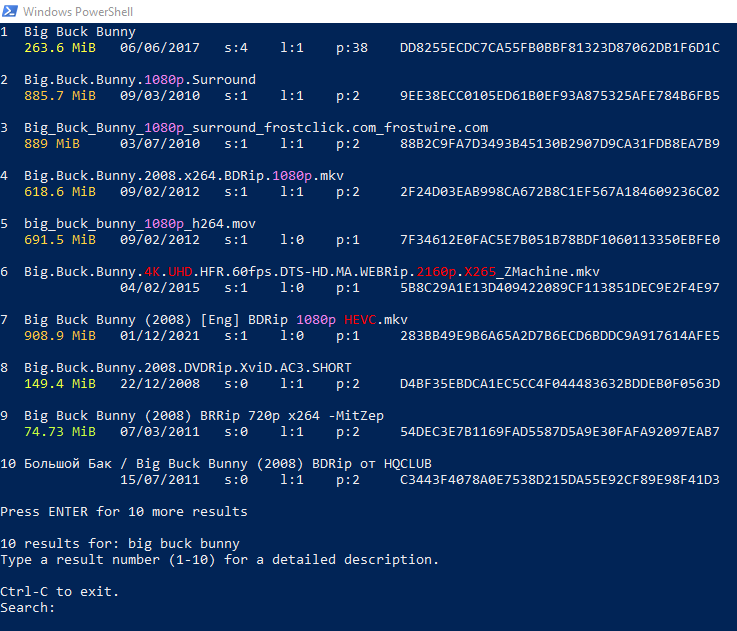

The largest open BitTorrent data set.  The data set is uncensored.  It certainly references unlawful content.

This data set may be used to track copyright/malware trends, or for training models in machine learning.

Torrent names have been slightly modified for easier reading (apostrophes, null, and backspace characters removed).  If you find this undesirable for research, let me know and I will release a raw dump.

I also have access to trackers data for all torrents, as well as records of the sources for the torrent info. This is quite extensive and would make the database very large which is why it is not included.  Contact me (open an issue) if you need this data.

